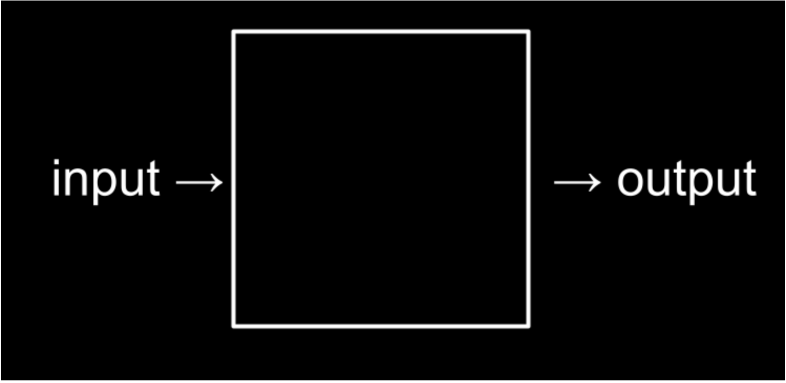

# Tuần 1

## Lời chào

- Chào mừng các bạn đã đến với buổi học đầu tiên của khoá học Giới thiệu về ngành Khoa học máy tính (Introduction to Computer Science)!

- Trong khoá học này, điều quan trọng nhất mà chúng ta sẽ cùng nhau học được đó là khả năng Giải quyết vấn đề (Problem-solving) bằng cách vận dụng các kỹ năng có tính ứng dụng rất cao của Khoa học máy tính

- Khối lượng kiến thức sẽ là không nhỏ, tuy nhiên mình tin rằng thời gian luôn đứng về phía chúng ta nếu chúng ta kiên định. Các bạn hãy cho bản thân đủ thời gian để làm quen, để trải nghiệm toàn bộ những giai đoạn sau:

  - Suy ngẫm và thắc mắc về kiến thức được dạy
  - Kiểm nghiệm lý thuyết bằng cách thực hành trực tiếp
  - Sẵn sàng thử nghiệm khi có ý tưởng mới
  - Tìm lỗi khi thất bại và cải thiện
  - Dần dần hoàn thiện các sản phẩm để chúng ngày càng tốt lên

- Dần dần, các bạn chắc chắn sẽ tiến bộ và nắm trong tay những công cụ và bộ kỹ năng rất mạnh mẽ để Giải quyết những vấn đề trong cuộc sống và xây dựng lên những sản phẩm tuyệt vời. Hãy cùng bắt đầu nhé!

## Lộ trình khoá học

## Bài học hôm nay

- Ở bài đầu tiên này, chúng ta sẽ cùng tìm hiểu những kiến thức sau:
  1. Khái niệm Tư duy tính toán (Computational Thinking)
  2. Cách Thông tin (Information) được Biểu đạt (Represent) trong máy tính
  3. Khái niệm Thuật toán (Algorithm)
  4. Khái niệm Lập trình (Programming)
  5. Giới thiệu Ngôn ngữ lập trình Scratch (Scratch Programming Language)

## Tư duy tính toán

- Tư duy tính toán là cách mà một Nhà khoa học máy tính tiếp cận việc Giải quyết các vấn đề. Học cách Tư duy tính toán chính là học cách để trở thành một Nhà khoa học máy tính

- Vậy trong Khoa học máy tính, việc Giải quyết vấn đề thông qua Tư duy tính toán có thể được hiểu như thế nào?

- Chúng ta sử dụng một Mô hình (Model) như sau để mô phỏng quá trình Giải quyết vấn đề bằng Tư duy tính toán, bao gồm có các thành phần:
  1. Đầu vào (Input): Làm sao để Biểu đạt Dữ liệu (Data) hoặc Thông tin (Information) cần thiết cho việc Giải quyết vấn đề?
  2. Xử lý (Process): Cần thực hiện các Hoạt động (Operation), Tính toán (Calculation) và Thao tác (Manipulation) nào lên Đầu vào để có thể Giải quyết vấn đề?
  3. Đầu ra (Output): Làm sao để Biểu đạt và sản sinh ra các Kết quả (Outcome) giúp thực hiện mục tiêu cuối cùng đó là Giải quyết vấn đề?



- Có thể thấy, Tư duy tính toán chính là chìa khoá cho mọi công đoạn của quá trình Giải quyết vấn đề

## Cách Thông tin được Biểu đạt trong máy tính:

- Trước khi học và ứng dụng Tư duy tính toán, chúng ta cần biết Thông tin và Dữ liệu được Biểu đạt như thế nào trong máy tính

- Trong đời sống hàng này, chúng ta đều quen với Cơ số 10 hay còn gọi là Thập phân (Decimal), bao gồm 10 chữ số: $0, 1, 2, ..., 9$

- Trong máy tính, để giảm thiểu độ phức tạp, các Bóng bán dẫn (Transistor) với chỉ 2 trạng thái Bật và Tắt được sử dụng để biểu thị Cơ số 2, bao gồm 2 chữ số $0$ và $1$

- Dẫu vậy, Cơ số 2 hay còn gọi là Nhị phân (Binary) vẫn cho phép máy tính Biểu đạt các dạng Thông tin và Dữ liệu khác nhau

### Dữ liệu Số (Number)

- Cho mục đích minh hoạ, chúng ta sẽ cùng tìm hiểu cách Biệu đạt các Số thập phân nguyên dương (Positive Integer) bằng một Chuỗi các Bit nhị phân (Sequence of Binary Bits)

- Với $1$ Bit Nhị phân, ta có thể Biểu đạt $2^1 = 2$ giá trị Thập phân:

```
[0, 1] tương ứng với [0, 1]
```

- Với $2$ Bit Nhị phân, ta có thể Biểu đạt $2^2 = 4$ giá trị Thập phân:

```
[0, 1, 2, 3] tương ứng với [00, 01, 10, 11]
```

- Với $3$ Bit Nhị phân, ta có thể Biểu đạt $2^3 = 8$ giá trị Thập phân:

```
[0, 1, 2, 3, 4, 5, 6, 7] tương ứng với [000, 001, 010, 011, 100, 101, 110, 111]
```

- Với $n$ Bit Nhị phân, ta có thể Biểu đạt $2^n$ giá trị Thập phân

- Để quy đổi từ Nhị phân sang Thập phân, ta có quy tắc sau:

| Nhị phân |                      Quy đổi (Phải sang Trái)                       | Thập phân |
| :------: | :-----------------------------------------------------------------: | :-------: |
|   101    |        $1 \times 2^0 + 0 \times 2^1 + 1 \times 2^2 = 1 + 4$         |     5     |
|   1010   | $0 \times 2^0 + 1 \times 2^1 + 0 \times 2^2 + 1 \times 2^3 = 2 + 8$ |    10     |

### Văn bản (Text)
